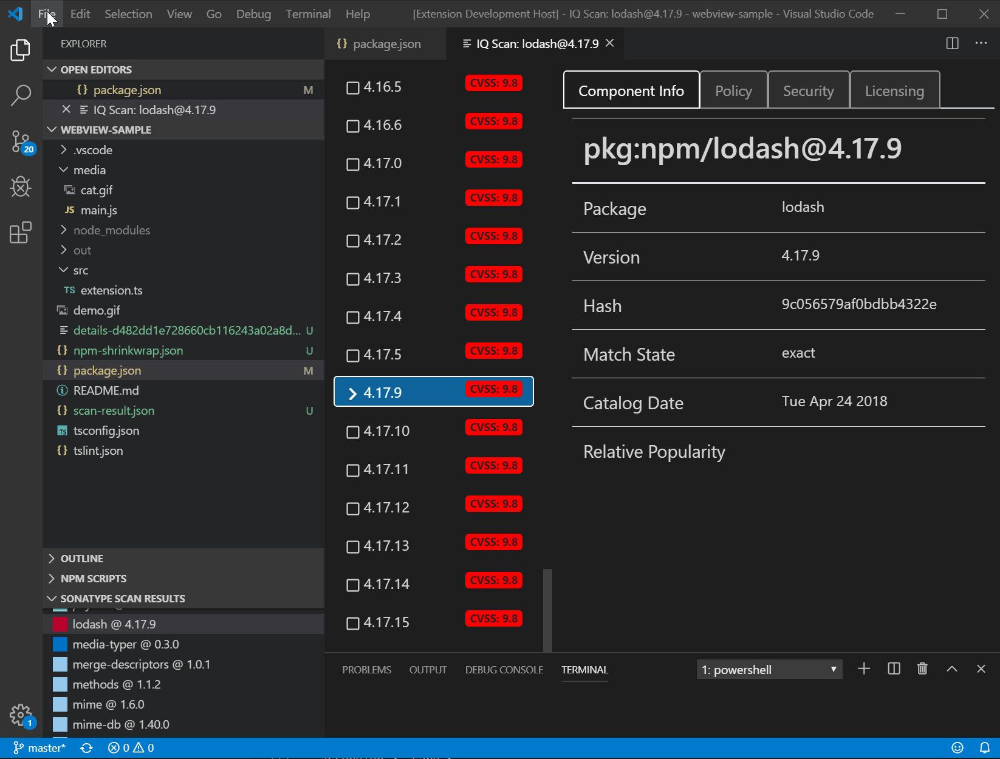
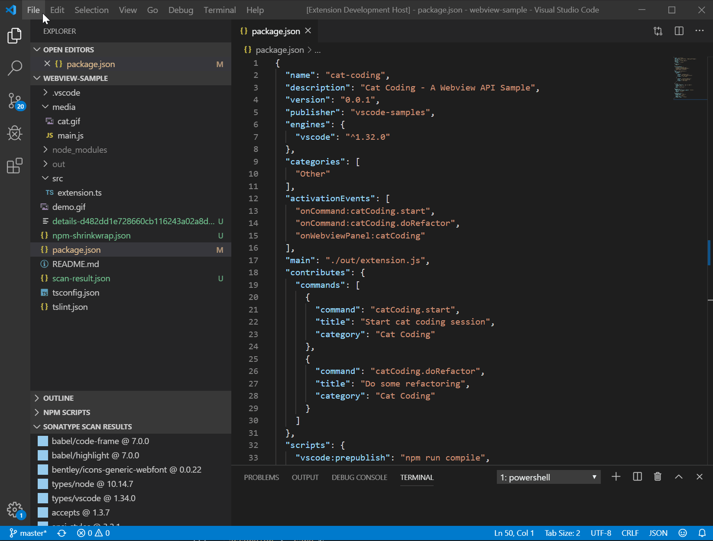

# Sonatype Nexus IQ Plugin for VS Code

Scan your libraries against either the free [OSS Index](https://ossindex.sonatype.org/) vulnerability database or the [Sonatype Nexus IQ Server](https://www.sonatype.com/nexus-iq-server). Drill down into all of your dependencies to examine each package version for security vulnerabilities. With IQ Server, it also provides policy and license details.

## Features

* Scan npm, Maven, Go or PyPi projects (Go is only supported on Linux or OS/X)
* See all components with vulnerable components highlighted

### Sonatype Nexus IQ Scan

 

### OSS Index Scan

### Themes

## Requirements
* To enable the IQ Scan, you will need a Sonatype Nexus IQ Lifecycle License but the OSS Index scan will work for all users
* The plugin requires npm, golang, maven or python and pip to be installed, depending on which language you are using. It will not install these as a part of the plugin

## Extension Settings
* Configuration is done in the VSCode `Preferences > Settings > Sonatype Explorer`

If you are using IQ Server, you can enter your password which will be stored in cleartext, or for additional security you can leave this blank and whenever you start VS Code (and if you have the Nexus Explorer Data Source set to `iqServer`) you will be prompted for a password:

If you are using IQ Server v76 or above, you can create a [user token](https://help.sonatype.com/iqserver/automating/rest-apis/user-token-rest-api---v2) and save this in the password field instead. The added benefit of doing this is that you are not storing your IQ Server password in plaintext, and rather a user token that can be deleted, etc... if need be.

## Outstanding Issues

* GoLang support is only for Linux or OS/X but not for Windows.

